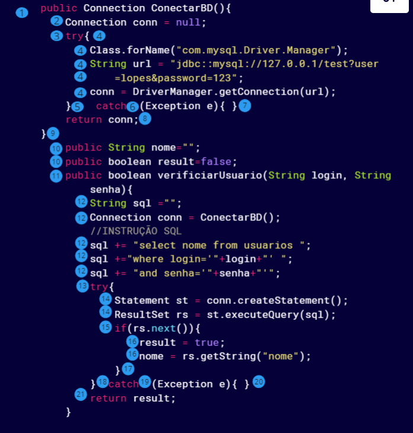
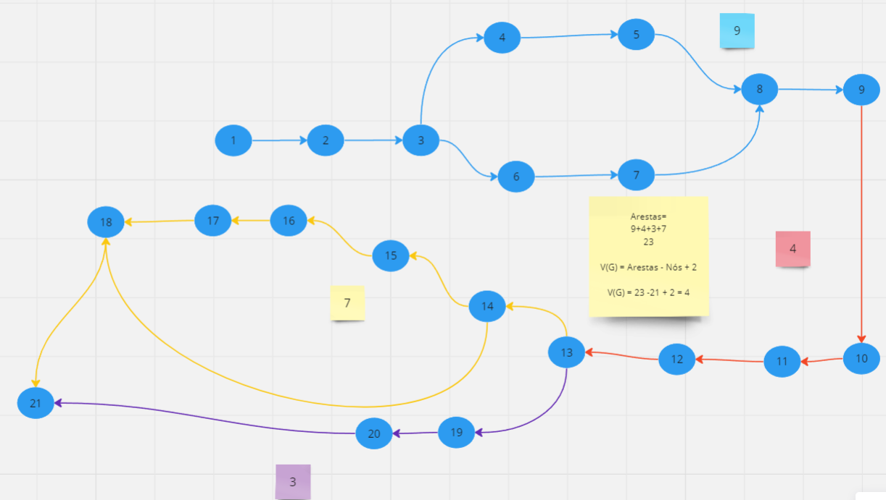

# Testes de Caixa branca

### Desenvolvedor:
 Felipe Roberto de Souza Silva
 
## Erros encontrados
1-Abertura da conexão do banco de dados não estava sendo fechada corretamente, causando um erro de conexão com o banco de dados.

Local
 - Deveria ser fechado no final do metodo verificarUsuario, mas não existe o fechamento da conexão com o banco de dados

2- Não tratamento correto dos catchs e exceptions

Local
 - Deveria ser tratado os catchs e exceptions, mas não existe o tratamento correto, não existindo nem um "print" da Exception

3- Exposição de informações sensíveis no código fonte (senha e login)

Local
 - Deveria ser criado um arquivo de configuração para armazenar as informações sensíveis, mas não existe o arquivo de configuração, em vez disso as informações foram inseridas dentro de uma string

4- Falta de comentários no código

Local
 - O codigo não possui nenhum comentário, dificultando a manutenção do código

5- Vulnerabilidade pois pode acontecer SQL Injection no código

Local
 - O codigo não possui nenhum tratamento para SQL Injection, podendo causar vulnerabilidade no sistema

6- Quebras do conceito SOLID (Single Responsibility Principle)

Local
 - A classe User possui um metodo que faz conexão com o banco de dados sendo que essa não é uma responsabilidade que essa classe deveria ter

# Miro

[Link para o quadro do Miro](https://miro.com/app/board/uXjVNfZZdbU=/?share_link_id=265233265789)

# Código anotado os nós

 

 # Grafo

 

# Complexidade
Regiões= 5
Arestas=
9+4+3+7
23

V(G) = Arestas - Nós + 2

V(G) = 23 -21 + 2 = 4

# Caminhos
Caminho(1)
1-2-3-4-5-8-9-10-11-12-13-14-15-16-17-18-21

Caminho(2)
1-2-3-4-5-8-9-10-11-12-13-14-18-21

Caminho(3)
1-2-3-4-5-8-9-10-11-12-13-19-20-21

Caminho(4)
1-2-3-6-7-8-9-10-11-12-13-14-15-16-17-18-21

Caminho(5)
1-2-3-6-7-8-9-10-11-12-13-14-18-21

Caminho(6)
1-2-3-6-7--8-9-10-11-12-13-19-20-21
